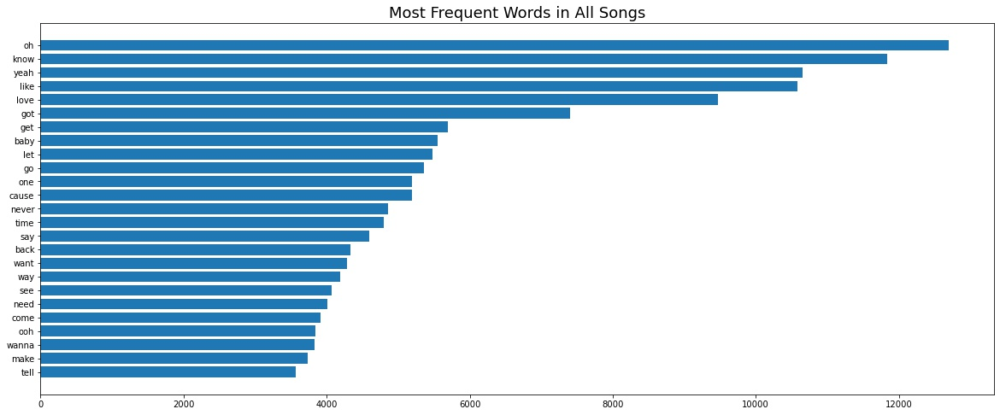
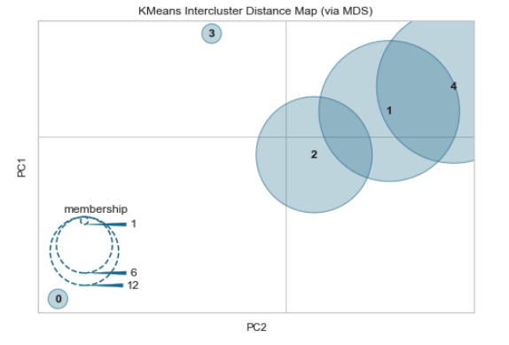
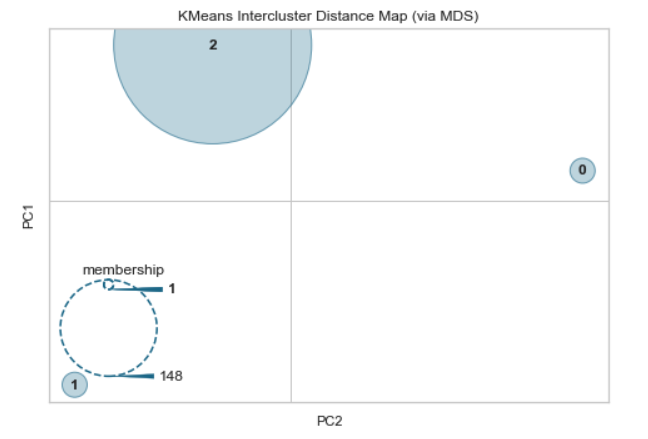
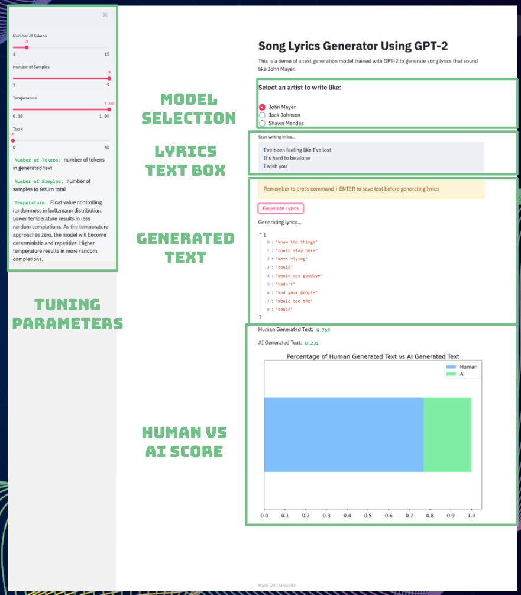

## Song Lyrics Generator Using GPT-2

#### Problem Statement

Overcoming writers block and writing creative lyrics can be a difficult task for most musicians, which leads to frustration and feeling "stuck". For this project, I have created a text generation model that is trained on a specific artist and suggests the next few words for an inputted song lyric in order to bring inspiration and make writing song lyrics easier for musicians. 

#### Executive Summary

The model has been created using [GPT-2 Simple](https://github.com/minimaxir/gpt-2-simple) and uses an interactive app created with [Streamlit](https://www.streamlit.io/) to allow the user to write new lyrics based on an individual artist and tune the desired output based on model parameters such as randomness and number of suggestions. Throughout the program, the user receives feedback based on what % of the lyrics were Human Generated vs. AI Generated. 

As a proof of concept, I trained 3 models on John Mayer, Jack Johnson, and Shawn Mendes'  lyrics. We learned some key takeaways such that:

* Using GPT-2, it is entirely possible to create a lyrics generator trained by a specific artist with dynamic outputs
* Even a few suggestions can help remove writer’s block and spark “creativity”
* GPT-2 is extremely powerful, however, note the tradeoff that it is very black box and computationally intensive
* Creating interactive apps is an excellent way to showcase the different parameters of a model and help interested people become familiar

Future iterations of the project include training models on [Google's BERT](https://github.com/google-research/bert) as well as more artists, genres, and even mood. 

#### Data Collection

I gathered my data from two main sources:

- Artists: https://www.billboard.com/charts/year-end
- Lyrics: https://lyricsgenius.readthedocs.io/en/master/index.html

**Scraping Billboard Charts**

I built a web scraper using [BeautifulSoup4](https://pypi.org/project/beautifulsoup4/) to collect the Top Artists from 2017-2019 in the categories of Folk/Americana and Pop music. The artist lists enabled me to have a range of well regarded artists to train a text generation model on and also spark interest for musicians wanting to write like one of these successful artists. 

**Scraping Song Lyrics**

To gather the song lyrics, I utilized a library called [Lyrics Genius](https://lyricsgenius.readthedocs.io/en/master/index.html), which scrapes song lyrics from the [Genius API](https://docs.genius.com/). I gathered roughly 5000 songs lyrics from the list of artists as seen below.

 

#### Exploratory Data Analysis

My goal for the exploratory analysis was to learn more about the similarities and differences between song lyrics across this range of artists. I explored the most common words as well as created a K-Means Clustering model to try to find similarities and differences between artists and an artist's individual songs. 

**Most common words**

It was common across all genres to see words such as `love`, `oh`, `know`, `like`, `baby`, `time`, `want`, `need`, and `yeah`. 

Unique words in the top 25 words to **Folk/Americana:**  `feel`, `man`, `take`, `well` 

Unique words in the top 25 words to **Pop:**  `make`, `ooh`, `tell`, `wanna` 

We might infer here that the Folk/Americana songs are more vulnerable and reflective, while Pop songs have stronger upbeat action words.

**K-Means Clustering**

My clustering model identified a few outliers within the dataset. In the graph below, we can make a couple of inferences:

- Drake (0) is an outlier compared to the rest of the artists, most likely because he is a rapper where the other artists tend to be singers. 
- Selena Gomez (3) was a bit surprising to see on this list. Some of here top words used were filler words such as `na`, `oh`, `ah`, `mm`, and `da` . 

   

**John Mayer's Songs**

I wanted to go one level deeper and investigate John Mayer's songs because I originally trained my model on his lyrics. Some notable words he uses are `love`, `say`, `heart`, `life`, `man`, `good`, `home` . These relate to his subject matter as well as matches common words in Folk/Americana songs. 

**K-Means Clustering**  

As one might expect for the same artist, their individual songs are similar. We did find two outliers here:

*  "Wanna Be Startin' Somethin'"(1) is in this list because it is not an original John Mayer song and was not labeled as so, which is why it passed our data cleaning where covers were removed. 
* "Say" (0) is a very popular song, however, there is not a whole lot of variation in the lyrics. It is mostly `say what you need to say` for the whole song, which is why I imagine it shows up in it's own cluster. 

 

#### Modeling with GPT-2 Simple

Based on the sheer size of a GPT-2 model, even trained on the smallest size (124M), I needed to use Google Colab in order to have enough GPU to train the model. In the GPT-2-Simple documentation, there is actually a [Google Colab notebook](https://colab.research.google.com/drive/1VLG8e7YSEwypxU-noRNhsv5dW4NfTGce) that can be used to train your text files. In this case, I trained three models model using all of John Mayer, Jack Johnson, and Shawn Mendes' lyrics. The models could then be tested locally using the [Streamlit App](https://github.com/Jmizraji/DSI-Capstone-Lyrics-Generator/blob/master/streamlit_app.py). 

**Note: the model is over 500MB,** so it is not included in the repo due to [Github's conditions for large files](https://docs.github.com/en/free-pro-team@latest/github/managing-large-files/conditions-for-large-files). Please [download the files](https://drive.google.com/drive/folders/1Sa4U3EtqBi82CYAVrEe5676sWZ0_Pom0?usp=sharing) , unzip them, and move them into the project repo for use. 

#### Streamlit App

 

**Brief Walkthrough**

(*Prerequisite - Must have [Streamlit](https://docs.streamlit.io/en/stable/), [GPT-2-Simple](https://github.com/minimaxir/gpt-2-simple), and the [models](https://drive.google.com/drive/folders/1Sa4U3EtqBi82CYAVrEe5676sWZ0_Pom0?usp=sharing) installed/downloaded*)

1. In your Terminal, **run** `$ streamlit run code/streamlit_app.py` 
2. Select an **artist** to write like
3. Type an **unfinished lyric** and press command + ENTER
4. Click **"Generate Lyrics"** to see your output
5. Use the **Tuning Parameters** to manipulate the generated outputs

`Number of Tokens:` number of tokens in generated text

`Number of Samples:` number of samples to return total

`Temperature:` Float value controlling randomness in boltzmann distribution. Lower temperature results in less random completions. As the temperature approaches zero, the model will become deterministic and repetitive. Higher temperature results in more random completions.

`Top k:` Integer value controlling diversity. 1 means only 1 word is considered for each step (token), resulting in deterministic completions, while 40 means 40 words are considered at each step. 0 (default) is a special setting meaning no restrictions. 40 generally is a good value.