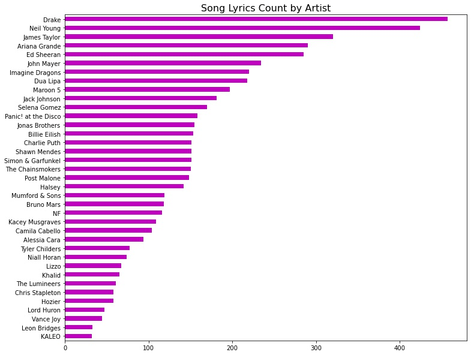
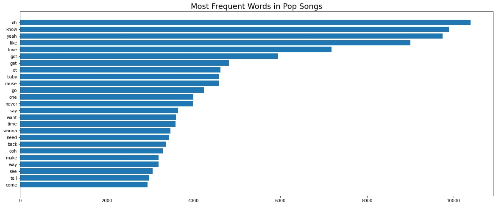
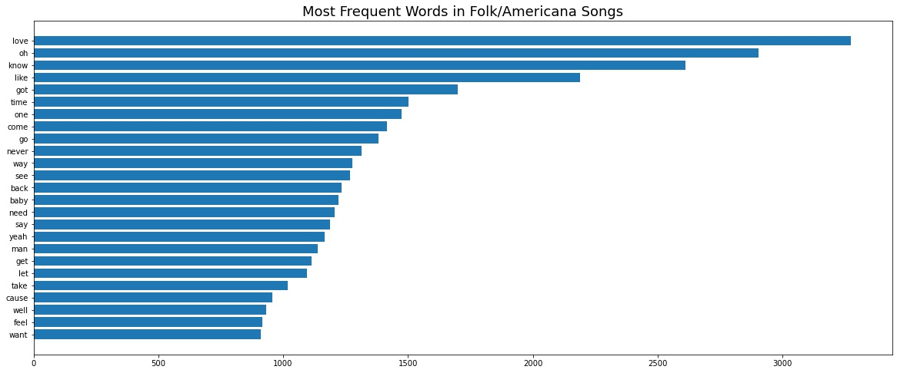
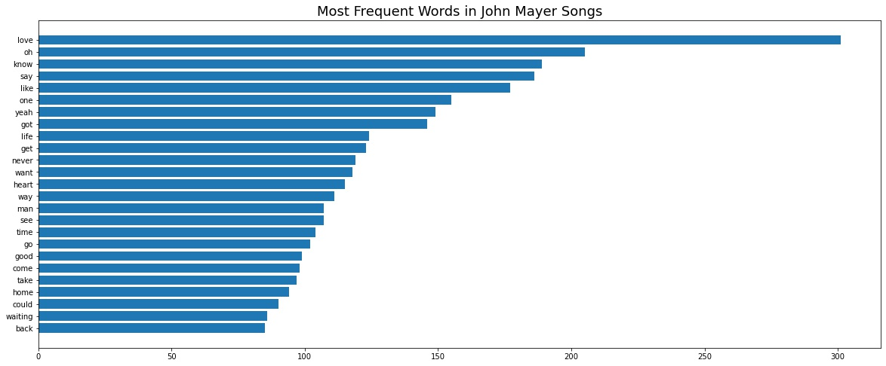
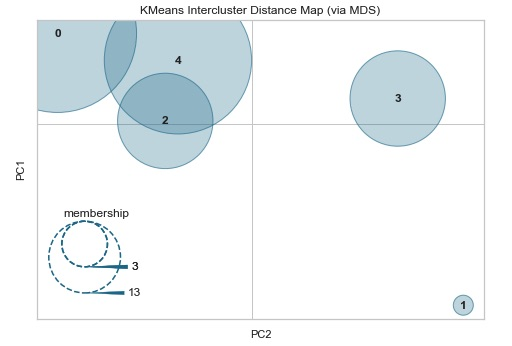
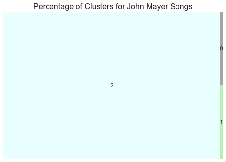
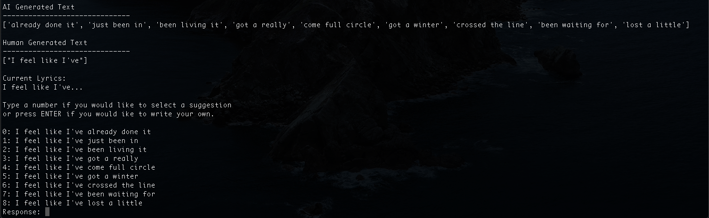
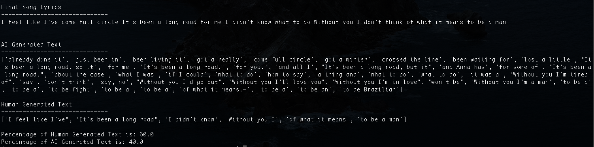

## Song Lyrics Generator Using GPT-2

#### Problem Statement

Overcoming writers block and writing creative lyrics can be a difficult task for most musicians, which leads to frustration and feeling "stuck". For this project, I have created a text generation model that is trained on a specific artist and suggests the next few words for an inputted song lyric in order to help musicians create new lyrics. 

The model has been created using [GPT-2 Simple](https://github.com/minimaxir/gpt-2-simple) and uses a .py script to run an interactive terminal program where the user can write new lyrics. Upon exiting the program, the user receives a score based on what % of the lyrics were Human Generated vs. AI Generated. 

As a proof of concept, I narrowed in on John Mayer's lyrics to train the model and write song lyrics. 

#### Data Collection

I gathered my data from two main sources:

- Artists: https://www.billboard.com/charts/year-end
- Lyrics: https://lyricsgenius.readthedocs.io/en/master/index.html

**Scraping Billboard Charts**

I built a web scraper using [BeautifulSoup4](https://pypi.org/project/beautifulsoup4/) to collect the Top Artists from 2017-2019 in the categories of Folk/Americana and Pop music. The artist lists enabled me to have a range of well regarded artists to train a text generation model on and also spark interest for musicians wanting to write like one of these successful artists. 

**Scraping Song Lyrics**

To gather the song lyrics, I utilized a library called [Lyrics Genius](https://lyricsgenius.readthedocs.io/en/master/index.html), which scrapes song lyrics from the [Genius API](https://docs.genius.com/). I gathered roughly 5000 songs lyrics from the list of artists as seen below.

 

#### Exploratory Data Analysis

My goal for the exploratory analysis was to learn more about the similarities and differences between song lyrics across this range of artists. I explored the most common words as well as created a K-Means Clustering model to try to find similarities and differences between artists and an artist's individual songs. 

**Most common words**

It was common across all genres to see words such as `love`, `oh`, `know`, `like`, `baby`, `don`, `want`, `need`, and `yeah`. 

**K-Means Clustering**

My clustering model identified a few outliers within the dataset. In the graph below, we can make a couple of inferences:

- Drake (1) is an outlier compared to the rest of the artists, most likely because he is a rapper where the other artists tend to be singers. 
- Ed Sheeran (3), Dua Lipa (3), and Ariana Grande (3) fall under the same cluster, which was surprising. However, the tops words in their songs were similar in that they were `love`, `baby`, `don`, and `yeah`.

   

**John Mayer's Songs**

As one might expect for the same artist, their individual songs are similar. We did find two outliers here:

*  "Wanna Be Startin' Somethin'"(2) is in this list because it is not an original John Mayer song and was not labeled as so, which is why it passed our data cleaning where covers were removed. 
* However, "Say" (1) is a very popular song, however, there is not a whole lot of variation in the lyrics. It is mostly `say what you need to say` for the whole song, which is why I imagine it shows up in it's own cluster. 

 

#### Modeling with GPT-2 Simple

Based on the sheer size of a GPT-2 model, even trained on the smallest size (124M), I needed to use Google Colab in order to have enough GPU to train the model. In the GPT-2-Simple documentation, there is actually a [Google Colab notebook](https://colab.research.google.com/drive/1VLG8e7YSEwypxU-noRNhsv5dW4NfTGce) that can be used to train your text files. In this case, I trained a model using all of John Mayer's lyrics and then further tuned the model to produce the results I wanted in the lyrics_bot_mayer.py script. 

*Note: the model is over 500MB, so it is not included in the repo due to [Github's conditions for large files](https://docs.github.com/en/free-pro-team@latest/github/managing-large-files/conditions-for-large-files). Please [download the file](https://drive.google.com/file/d/1-7YXMBbt7YuXuOeExd4w_KXsRAeS8Pnt/view?usp=sharing) , unzip it, and move it into the project repo for use. 

**Brief Walkthrough**

1. In your Terminal, run `$ python lyrics_bot_mayer.py` 

2. Type the first few words of a lyric, unfinished sentences work best here. Ex. `It's been a..`
   

3. Continue with the the program until you are satisfied with your lyrics. When complete, type `STOP` to exit.

    

4. Review your final results and what % came from Human vs. AI. 

     